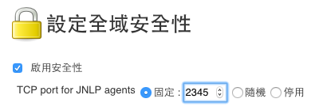
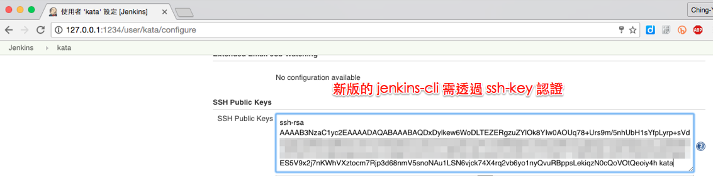

## Jenkins Cli

### 產生 SSH Key

```
ssh-keygen -C kata
```

PS. 下列範例以檔名 `jenkins_kata` 為例

### 取得 cli

```
wget http://127.0.0.1:1234/jnlpJars/jenkins-cli.jar
```

### 啟用 cli

設定 TCP port (Web Console: `管理 Jenkins` -> `設定全域安全性`)



設定使用者 SSH Public Key (Web Console: `使用者` -> `kata(你的使用者名稱)` -> `設定` )



### 呼叫 Cli

```
java -jar jenkins-cli.jar -s http://127.0.0.1:1234/ -i jenkins_kata help
```

* `-i` 後接的是 SSH Private Key
* `help` 是查詢有哪些指定可用

```
  add-job-to-view
    Adds jobs to view.
  build
    建置作業，並可以依要等侯建置完成。
  cancel-quiet-down
    取消 "quiet-down" 指令。
  clear-queue
    清除建置佇列。
  connect-node
    連線到指定節點。
  console
    Retrieves console output of a build.
  copy-job
    複製作業。
  create-credentials-by-xml
    Create Credential by XML
  create-credentials-domain-by-xml
    Create Credentials Domain by XML
  create-job
    建立新作業，由 stdin 讀取設定 XML 檔的內容。
  create-node
    Creates a new node by reading stdin as a XML configuration.
  create-view
    Creates a new view by reading stdin as a XML configuration.
  delete-builds
    刪除建置記錄。
  delete-credentials
    Delete a Credential
  delete-credentials-domain
    Delete a Credentials Domain
  delete-job
    刪除作業。
  delete-node
    刪除指定節點。
  delete-view
    Deletes view(s).
  disable-job
    停用作業。
  disconnect-node
    中斷與指定節點的連線。
  enable-job
    啟用作業。
  get-credentials-as-xml
    Get a Credentials as XML (secrets redacted)
  get-credentials-domain-as-xml
    Get a Credentials Domain as XML
  get-gradle
    List available gradle installations
  get-job
    將作業定義 XML 傾印到 stdout
  get-node
    Dumps the node definition XML to stdout.
  get-view
    Dumps the view definition XML to stdout.
  groovy
    執行指定的 Groovy Script。
  groovysh
    以互動式 Groovy Shell 方式執行。
  help
    列出所有可用的指令。
  install-plugin
    由檔案、URL 或是更新中心安裝外掛程式。
  install-tool
    自動安裝工具，將其位置列印到 stdout。只能在建置中呼叫。
  keep-build
    永久保存這次建置。
  list-changes
    印出指定建置的變更記錄。
  list-credentials
    Lists the Credentials in a specific Store
  list-credentials-context-resolvers
    List Credentials Context Resolvers
  list-credentials-providers
    List Credentials Providers
  list-jobs
    列出指定視景或項目群組中的所有作業。
  list-plugins
    輸出安裝的外掛程式清單。
  login
    儲存目前的驗證資訊，接下來的指令都可以直接執行而不用輸入驗證資料。
  logout
    刪除 login 指令儲存的驗證資料。
  mail
    讀取 stdin 並將結果以 e-mail 方式傳送。
  offline-node
    暫時不使用指定節點來建置，直到執行 "online-node" 指令為止。
  online-node
    Resume using a node for performing builds, to cancel out the earlier "offline-node" command.
  quiet-down
    讓 Jenkins 沉澱一下，準備重新啟動。先不要再建置任何作業。
  reload-configuration
    放棄所有記憶體裡的資料，由檔案系統中重新載入。適合在直接修改設定檔後使用。
  reload-job
    Reload job(s)
  remove-job-from-view
    Removes jobs from view.
  replay-pipeline
    Replay a Pipeline build with edited script taken from standard input
  restart
    重新啟動 Jenkins
  safe-restart
    安全的重新啟動 Jenkins
  safe-shutdown
    讓 Jenkins 進入靜候模式，等到現有作業都完成後就將 Jenkins 停機。
  session-id
    Outputs the session ID, which changes every time Jenkins restarts.
  set-build-description
    設定建置描述說明。
  set-build-display-name
    設定建置的顯示名稱
  set-build-parameter
    Update/set the build parameter of the current build in progress.
  set-build-result
    設定目前建置的結果。在建置中呼叫才有作用。
  set-external-build-result
    Set external monitor job result.
  shutdown
    立即將 Jenkins 伺服器停機
  update-credentials-by-xml
    Update Credentials by XML
  update-credentials-domain-by-xml
    Update Credentials Domain by XML
  update-job
    由 stdin 更新作業定義 XML。get-job 指令的相反
  update-node
    Updates the node definition XML from stdin. The opposite of the get-node command.
  update-view
    Updates the view definition XML from stdin. The opposite of the get-view command.
  version
    輸出目前的版本。
  wait-node-offline
    等候指定節點離線。
  wait-node-online
    等候指定節點上線。
  who-am-i
    產出您驗證以及權限資訊的報表
```
