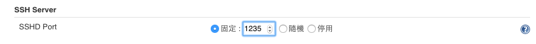

## Demo

Demo 前置作業需先設定好 [jenkins-cli](CLI.md)，並安裝需要的 Plugin。

## Plugin 安裝

### Plugin Id: copyartifact

```
java -jar jenkins-cli.jar -s http://127.0.0.1:1234/ -i jenkins_kata install-plugin copyartifact
```

### Plugin Id: workflow-cps-global-lib


*設定 SSHD*

使用 shared library 需要用 git repo，目前的 plugin 搭配 sshd 使用



```
java -jar jenkins-cli.jar -s http://127.0.0.1:1234/ -i jenkins_kata install-plugin workflow-cps-global-lib
```

*設定 ssh config*

設定 ssh config 將 `git.jenkins.kata` 對應至 `127.0.0.1:1235`，將以使用者 `kata` 與對應的 private key 進行認證

```
Host git.jenkins.kata
HostName 127.0.0.1
Port 1235
User kata
IdentityFile ~/.ssh/jenkins_kata
```

第 1 次 checkout 因為沒有內容，所以只會建空目錄：

```
qty:JenkinsPipelineKata qrtt1$ git clone ssh://git.jenkins.kata/workflowLibs.git
Cloning into 'workflowLibs'...
The authenticity of host '[127.0.0.1]:1235 ([127.0.0.1]:1235)' can't be established.
RSA key fingerprint is 38:c6:24:fd:5a:df:92:f4:51:3f:92:ca:c3:a2:36:a7.
Are you sure you want to continue connecting (yes/no)? yes
Warning: Permanently added '[127.0.0.1]:1235' (RSA) to the list of known hosts.
Checking connectivity... done.
warning: remote HEAD refers to nonexistent ref, unable to checkout.
```
