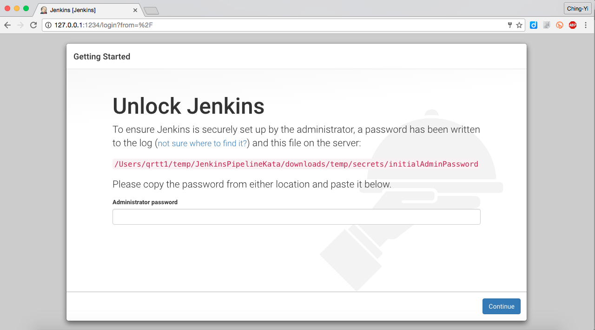
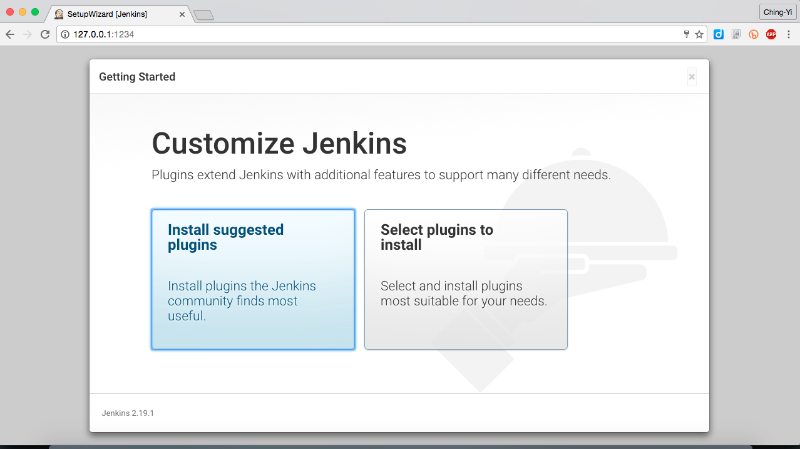
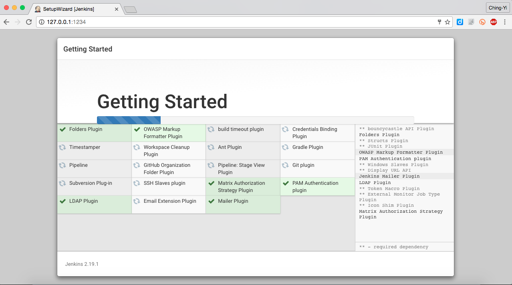
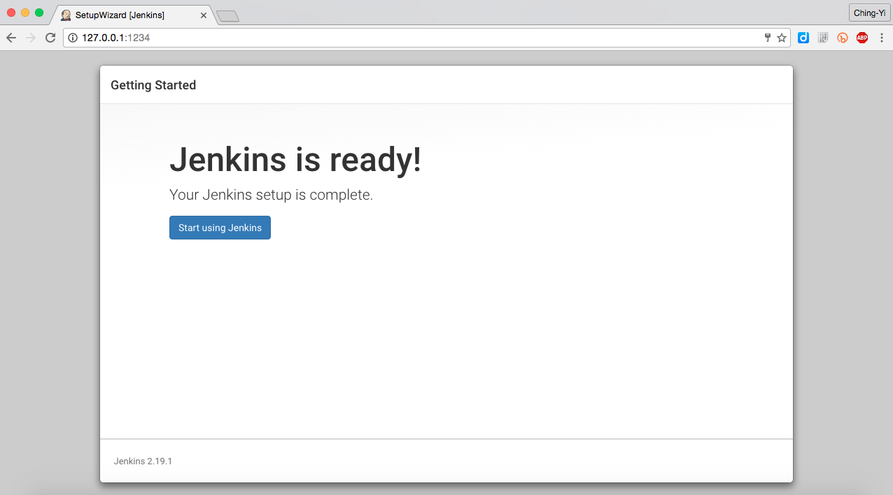

# Jenkins Pipeline KATA

## 安裝

### 取得 Jenkins

由 Jenkins 官網下載 WAR 檔。

### 啟動 Jenkins

```
JENKINS_HOME=./temp java -jar jenkins.war --httpPort=1234
```

* 預設 Jenkins 會使用 `$HOME/.jenkins` 的位置作為工作目錄，透過 ```JENKINS_HOME``` 能指定不同的目錄
* 預設 Jenkins 會使用 `8080` port，使用 `--httpPort` 能指定不同的 port


在啟動的過程會看到：

```
*************************************************************
*************************************************************
*************************************************************

Jenkins initial setup is required. An admin user has been created and a password generated.
Please use the following password to proceed to installation:

16816244bd2440728414eac7c13f317c

This may also be found at: /Users/qrtt1/temp/JenkinsPipelineKata/downloads/temp/secrets/initialAdminPassword

*************************************************************
*************************************************************
*************************************************************
```

在第 1 次啟動時，需輸入此隨機密碼：




### 安裝 Plugin 與設定帳號

通過驗證後，需選擇 plugin 的安裝。選擇 `Install suggested plugins` 繼續常用 Plugin 安裝：



等待安裝完成：



看到 `Jenkins is ready` 時，就是完成安裝了：



接著，它會要求你建立 Admin 帳號：


完成後，就能登入 Jenkins：


