## 引言

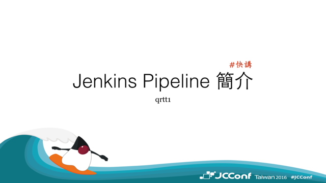

這次的「快講」挑了 Jenkins Pipeline 的主題來介紹。他算是 Jenkins 2.x 後主推的功能。
雖然他並不是在 2.x 之後才有的 Plugin。但依「官網」文件安排可以看出 Pipeline 是被 Highlight 出來的重點功能。

## 什麼是 Pipeline

### 關於 Pipeline

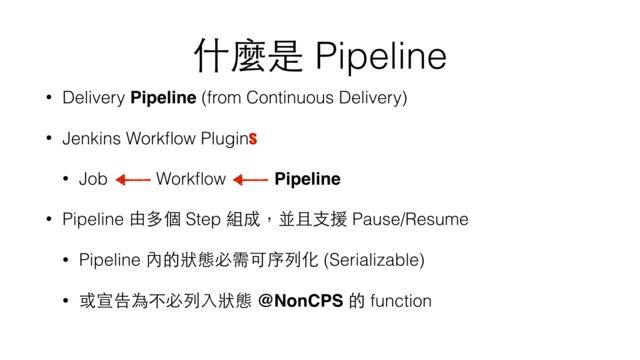

在 IT 領域，我們常會選擇一些隱喻的辭來描述工作現場的事件或術語，像是以雲端隱喻網路。
而 Pipeline 則是隱喻軟體開發「流程」，因為由開發產出的原始碼或設計師產出的成品，透過若干連續的步驟合成為最終的產品。如同工廠裡的流水線一般。

在這裡的 Pipeline 應該源於 [Continuous Delivery](https://www.amazon.com/Continuous-Delivery-Deployment-Automation-Addison-Wesley-ebook/dp/B003YMNVC0/ref=mt_kindle?_encoding=UTF8&me=) 書本上倡導的 Delivery Pipeline 的概念：

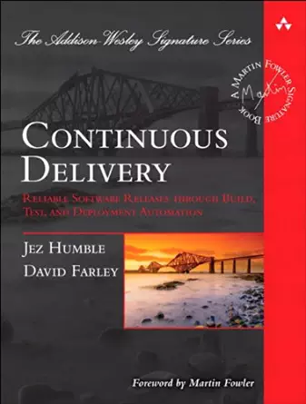

在 Jenkins 2.x 後，將 Pipeline Plugin 列為預設會安裝的 Plugin（若是使用 Jenkins 1.x 仍可透過安裝 Pipeline Plugin 使用它），在這之前它並非被稱作 Pipeline。
只能推測因為 DevOps 興起後 Delivery Pipeline 概念的推廣，讓 Pipeline 的隱喻有較高的能見度。於是將 *Workflow* Plugin 改了名字，成為 [Pipeline Plugin](https://wiki.jenkins-ci.org/display/JENKINS/Pipeline+Plugin)：

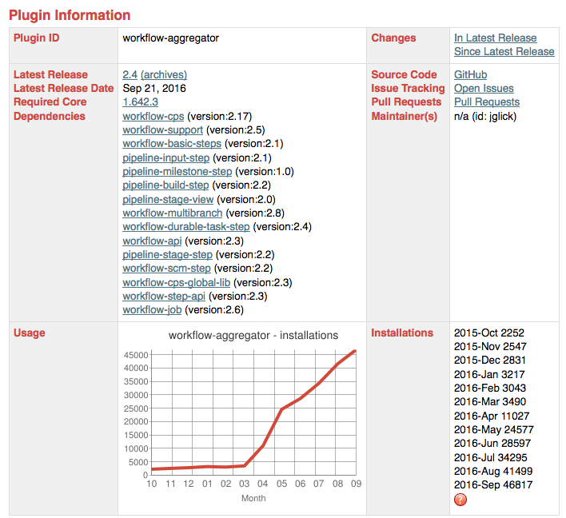

實際上它只有換了「名稱」但身份證字號並沒有換，Plugin ID (workflow-aggregator ) 依然保留著 workflow 的字樣，較晚開發的 Plugin 才漸漸捨棄 workflow 的字樣，開始以 pipeline 為名。

### 關於 Pipeline Job

具體來說，Jenkins Pipeline 實際只是 Job 的一種型式。所以在 Jenkins 內使用 Pipeline 就是建立 1 個 Pipeline Job，而 Pipeline 由多個 step 組成，step 即為實際上的執行邏輯。

另外得注意的是，Jenkins Pipeline 試圖支援 Pause/Resume 的功能，為了能讓 Pipeline Job 保存狀態，所以 pipeline 必需是可以序列化的，或是以 function 的型式透過 `@NonCPS` annotation 宣告此 function 不保留狀態（但這僅適用於能快速執行完的 function，不然 Jenkins 會試等待它結束）。

## 為什麼該用 Pipeline

在網官介紹 Pipeline 的部分這麼說：

> Pipelines are Jenkins jobs enabled by the Pipeline (formerly called "workflow") plugin and built with simple text scripts that use a Pipeline DSL (domain-specific language) based on the Groovy programming language.

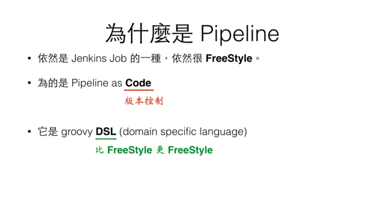

在過去我們能使用 FreeStyle Job 搭配各式各樣的工具，像是 Ant, Maven 或 Shell Script 建立單一的建置流程。無論內容單簡、複雜全都塞進一組 Job 內，若是需要定義 Job 間的協作，需透過 Web Console 設定觸發條件來。

現在 Pipeline Job 提供 Pipeline DSL 透過簡單的語法，讓你透過 Pipeline DSL 組織工作，並能在 Pipeline 區分工作階段且能透過 "step" 明確呼叫其他 Jenkins Job。在建置工作流程上的表現更加直覺，有著 FreeStyle Job 的自由度，也有 Pipeline as Code 的透明感，並且因為 Pipeline as Code 達成 Continuous Delivery 倡導的，事事都上版控，不放棄任何細節的追蹤管理。

## Pipeline DSL

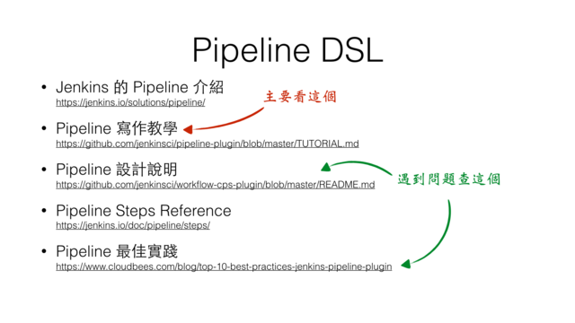

因此，我們可以意識到，要上手 Jenkins Pipeline 的一個重點在於學習 Pipeline DSL。今天只有不到 15 分鐘的時間，這邊僅列出學習資源。等一下透過簡單的 demo 跟大家介紹一下 Pipeline DSL 長什麼樣子，該怎麼使用它。

## Pipeline Job

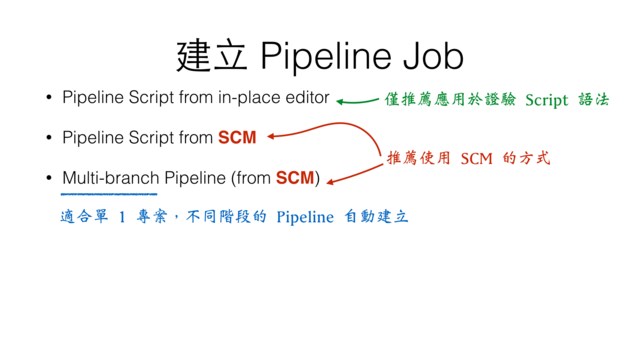

建立 Pipeline Job 的型式主要分為二種：

* Pipeline

    就是 1 個 Pipeline 對應 1 個 Job。它允許你直接透過 Web Console 在 Script Box 內直接寫 Pipeline DSL，不過這只推薦給初學者做實驗用，或是驗證一下新的 Pipeline 寫法是不是合用，因為這麼寫少了提交 Pipeline DSL 進版本控制系統的流程，在開發上比較快一些。另一種方式是透過版本控制系統拉回來的檔案使用，需要指定 repository 的位置與 Pipeline DSL 的路徑。

* Multibranch Pipeline

    Multibranch Pipeline 就是讓你指定 1 個版本控制系統的 repository 與 1 個 Pipeline DSL 路徑，它會依 branch 建出所有的 Pipeline Job。這很適用在專案的不同狀態，例如在你 1 個 Web 專案建出 {product, staging, testing} 3 個 branch，它就會建出 3 個 Pipeline Job。

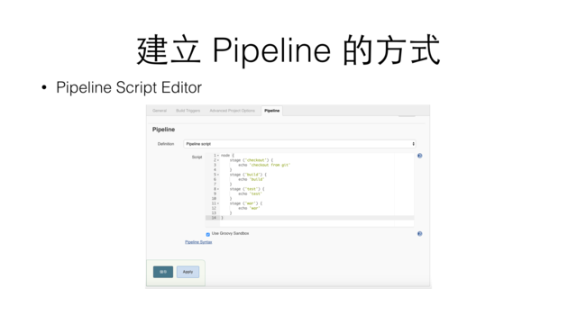
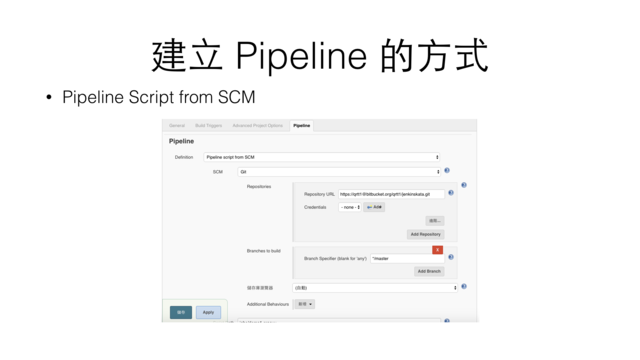

## Pipeline 規劃

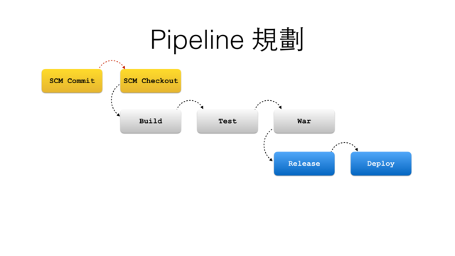

這是個簡化版的 Pipeline Flow，在官網上有個較完整的[範例](https://jenkins.io/images/pipeline/realworld-pipeline-flow.png)，後讀的 demo 我們會以灰色 block 部分為主。這每一個 block 換作 Jenkins Pipeline 的術語，則是 stage (階段)，在每個階段有各自執行的指令，當 Pipeline DSL 遇到 `stage` 指令(step) 時，就會在 Stage View 建出一欄資料表示，這樣在哪個階段失敗都看得一清二楚：

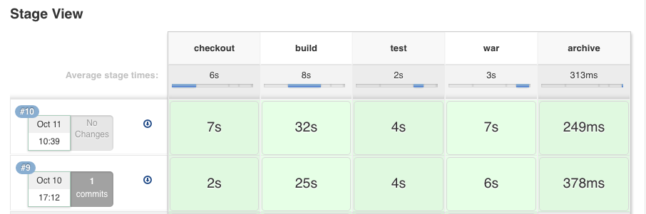

## Demo

接下來會透過簡單的例子來展示 Pipeline Job 與 Pipeline DSL 的使用。

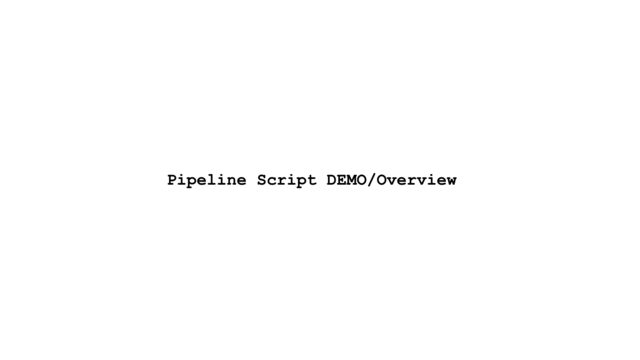

## Steps

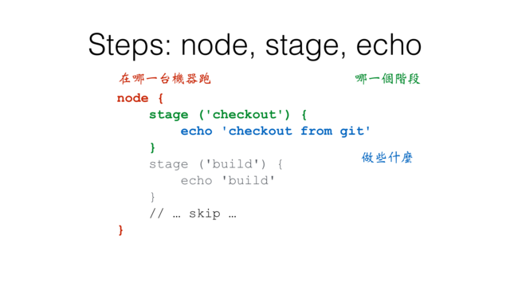
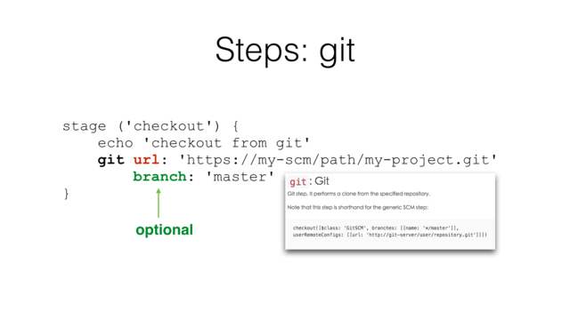
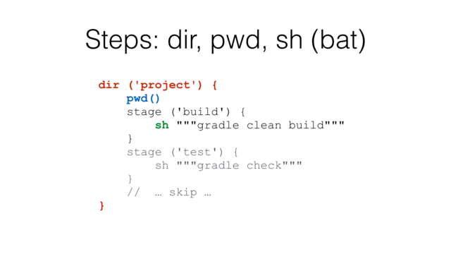
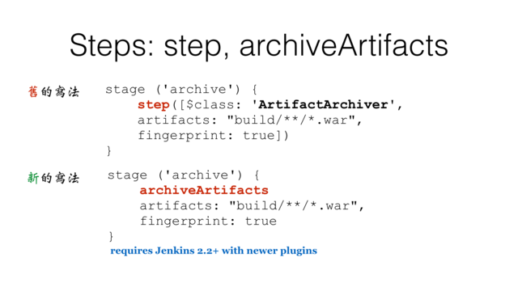

## Refactoring

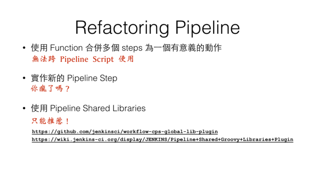

## Shared Library

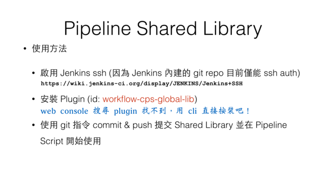

## My opinion

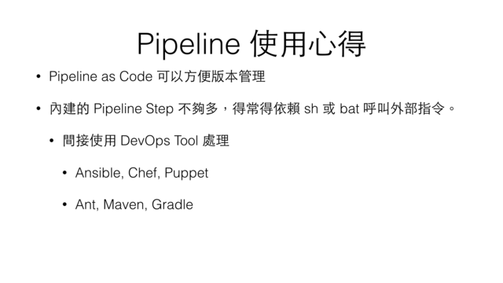

## Any questions ?

